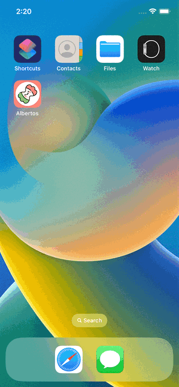

# Alberto's Restaurant

  
    

This is a sample restaurant app using the TDD process with SwiftUI and Combine.

The source code is part of the tutorial in the Test-Driven Development in Swift book. I included some personal touches and additional features.

## Test Coverage Stats

| Module           | Tests | Lines | Coverage |
|------------------|-------|-------|----------|
| Albertos         |  27   | 438   | 58,5%    |
| AlbertosCore     |  11   |  87   | 96,6%    |

**Notes:**

* No tests were created for The HyppoPayments and HyppoAnalytics frameworks because they represent pseudo third-party code responsible to process and track payments.

* All logic was extracted from the view to be as clean as possible and tested separated, so there are no tests in SwiftUI Views, Protocols, Extensions and Button Styles e.g). That's why the coverage it's lower.

* It's possible target AlbertosCore to Mac Device in order to have faster feedback from tests.

## Demo

## Considerations and Decisions taken

The main differences and changes from the book:

1. The project was separated into layers:
  * Presentation and Views (Alberto App),
  * Domain and Features (Alberto Core framework),
  * Payments Process (HyppoPayments and HyppoAnalytics frameworks).

2. The source files were organised into folders according to their responsibility.

3. Wherever possible the code has been optimised using helper methods, classes and high order functions.

4. The hard code helper methods and properties using in SwiftUI Views were moved to Preview Content folder. This change allows to remove unnecessary references to the project and also prevent these files from going into production.  

5. The Network access was modified to centralize the access point in the Composition Root (main). With this change it was possible to reduce some classes and protocols and simplify the access point.

6. The book accidentally introduces a Retains Circle problem, the fix was made in this project. The Pull Request was sent to the author of the book (it hasn't been fixed yet).

7. Small compromises were made to facilitate the tracking of project progress. Besides being best practice!

## TODO's

* Create snapshot test.
* Add image, description in MenuDetail.
* Make possible to order more than one of the same item.
* Move url path and change json file with image and description).
* When order are placed from MenuDetail view after checkout the screen is dismissed. However, it would be nice if it returned to the initial screen.

---

## Documentation (Book)
+ [Test-Driven Development in Swift: Compile Better Code with XCTest and TDD ](https://www.amazon.com/Test-Driven-Development-Swift-Compile-Better-ebook/dp/B098HZ9LLD/ref=sr_1_1?crid=V77WWNISPC48&keywords=Test-Driven+Development+in+Swift%3A+Compile+Better+Code+with+XCTest+and+TDD+by+Gio+Lodi+%28Apress%2C+2021%29.&qid=1666260006&qu=eyJxc2MiOiItMC4wMSIsInFzYSI6IjAuMDAiLCJxc3AiOiIwLjAwIn0%3D&sprefix=test-driven+development+in+swift+compile+better+code+with+xctest+and+tdd+by+gio+lodi+apress%2C+2021+.%2Caps%2C212&sr=8-1) by Gio Lodi (Apress, 2021).
